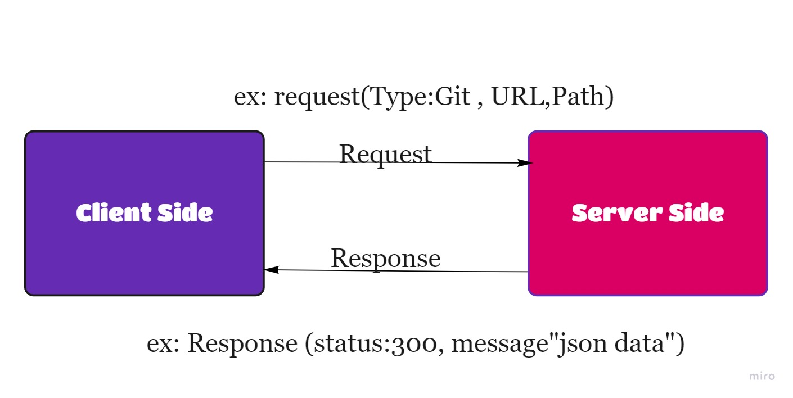

# Movies-Library
# Movies-Library - 1.0.0

**Author Name**: Hanan Nathem Saadeh

## WRRC

## Overview
## Getting Started
A- Create a package.json file  (npm init -y).
B- install all the dependencies  (npm install).
C- install express (npm install express)
D- once your done with the installation, just type node server to initialize the server.
## Project Features
movie app that can check the latest movies based on categories.

